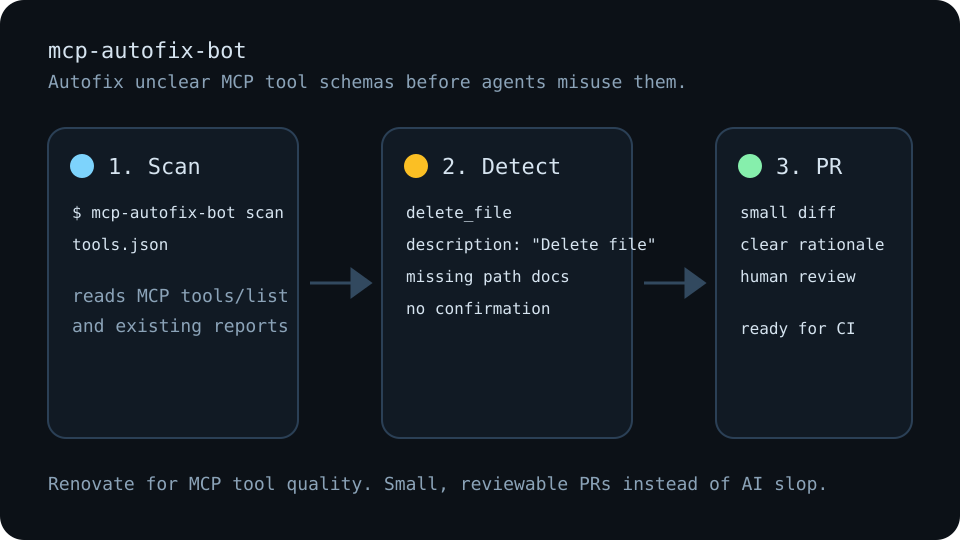

# mcp-autofix-bot

**Autofix unclear MCP tool schemas before agents misuse them.**

`mcp-autofix-bot` is a PR bot for Model Context Protocol servers. It reads MCP quality reports, proposes safer tool descriptions and JSON Schema fixes, and prepares reviewable pull requests for maintainers.

Think **Renovate for MCP tool quality**: small diffs, clear rationale, CI-friendly reports, and no drive-by AI slop.



## Why this exists

MCP tool descriptions are execution contracts, not just docs. Agents use them to decide which tool to call, which arguments to send, and whether an action is safe. Vague descriptions and loose schemas can cause wrong tool selection, bad arguments, or unsafe side effects.

This project focuses on reviewability:

- Find unclear tool descriptions and underspecified input properties.
- Flag side-effectful tools that lack confirmation, preview, or dry-run semantics.
- Generate review-marked JSON previews that humans can review before applying.
- Turn the results into GitHub Actions artifacts and pull request summaries.

## Quick start

```bash
npm install
npm test
npm run scan
npm run fix
npm run pr
```

CLI interface:

```text
mcp-autofix-bot scan <tools.json> [--json] [--output report.json]
mcp-autofix-bot fix <tools.json> --dry-run [--json]
mcp-autofix-bot pr <report.json> (--dry-run | --create)
```

Scan a tools manifest:

```bash
npx mcp-autofix-bot scan examples/bad-mcp-server/tools.json --json --output report.json
```

Preview review-marked JSON changes without writing files:

```bash
npx mcp-autofix-bot fix examples/bad-mcp-server/tools.json --dry-run --json > preview.json
```

Preview the pull request it would prepare:

```bash
npx mcp-autofix-bot pr report.json --dry-run
```

Create a live pull request only when you intentionally want the GitHub side effect:

```bash
npx mcp-autofix-bot pr report.json --create
```

## What it catches today

- `tool-description-vague`: descriptions that are too short or not written as clear agent instructions.
- `property-description-missing`: input schema properties without descriptions.
- `dangerous-tool-needs-confirmation`: destructive or side-effectful tools without confirmation, preview, or dry-run affordances.

The report reader also normalizes fixtures shaped like `mcp-lint`, `mcp-assert`, and `mcpdiff` output so workflows can compose with existing MCP quality tools.

## Before and after

See [examples/before-after.md](./examples/before-after.md) for three concrete fixes:

- vague descriptions,
- missing parameter semantics,
- destructive tools without confirmation.

## GitHub Action

```yaml
name: MCP tool quality

on:
  pull_request:
  push:
    branches: [main]

jobs:
  mcp-autofix:
    runs-on: ubuntu-latest
    steps:
      - uses: actions/checkout@v4
      - uses: actions/setup-node@v4
        with:
          node-version: 22
      - run: npm ci
      - run: npx mcp-autofix-bot scan examples/bad-mcp-server/tools.json --json --output mcp-autofix-report.json
      - run: npx mcp-autofix-bot fix examples/bad-mcp-server/tools.json --dry-run --json > mcp-autofix-preview.json
      - uses: actions/upload-artifact@v4
        with:
          name: mcp-autofix-artifacts
          path: |
            mcp-autofix-report.json
            mcp-autofix-preview.json
```

A complete example lives in [.github/workflows/mcp-autofix.yml](./.github/workflows/mcp-autofix.yml).

## Launch strategy

The project should earn trust before chasing stars:

1. Open 5 high-quality, human-reviewed PRs against real MCP servers.
2. Publish one scan report summarizing recurring schema issues.
3. Submit the project to MCP directories after there is real PR evidence.
4. Launch on developer channels with the message: `Show HN: A bot that fixes unclear MCP tool schemas and opens PRs`.

See [docs/launch-playbook.md](./docs/launch-playbook.md) for the full plan.

## Guardrails

- Do not claim this makes MCP servers safe.
- Do not mass-open PRs.
- Do not rewrite unrelated docs or code.
- Do not run `pr --create` unless you intentionally want a live GitHub PR.
- Every generated PR should be small, readable, and easy to close.

## License

AGPL-3.0-only
